# Week 7

## 5.1 - Loops and Iteration

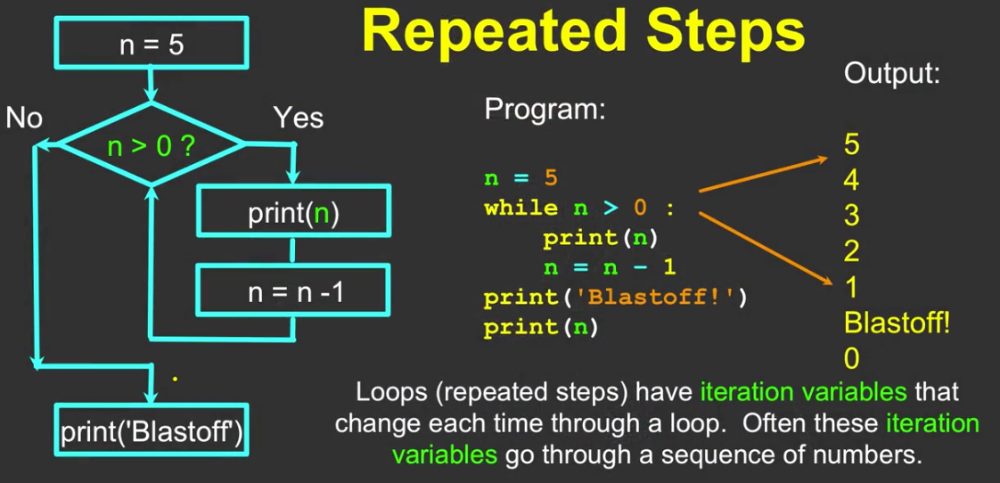

#### Key Words

`while`

`for`
`break`

---


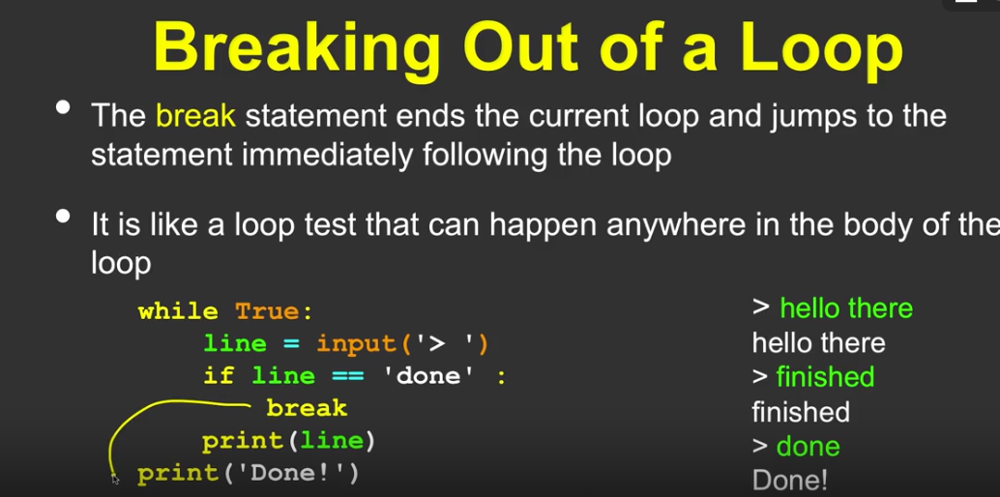

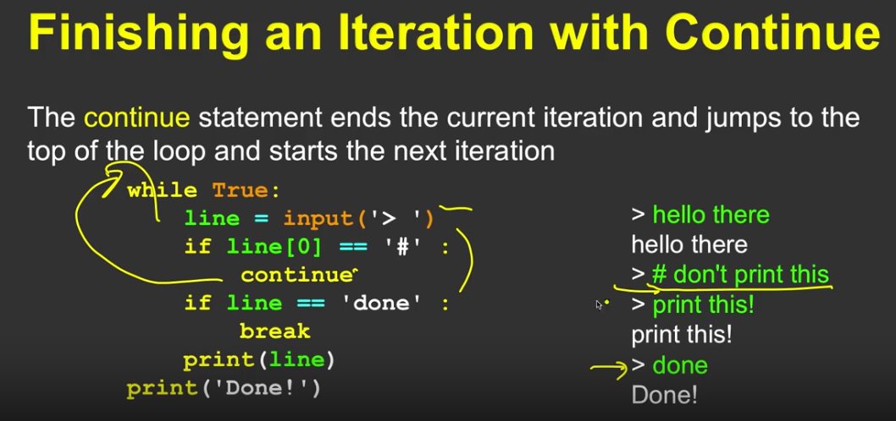

## 5.2 - Definite Loops

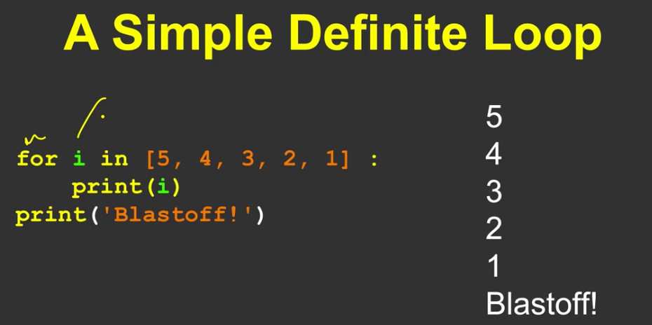

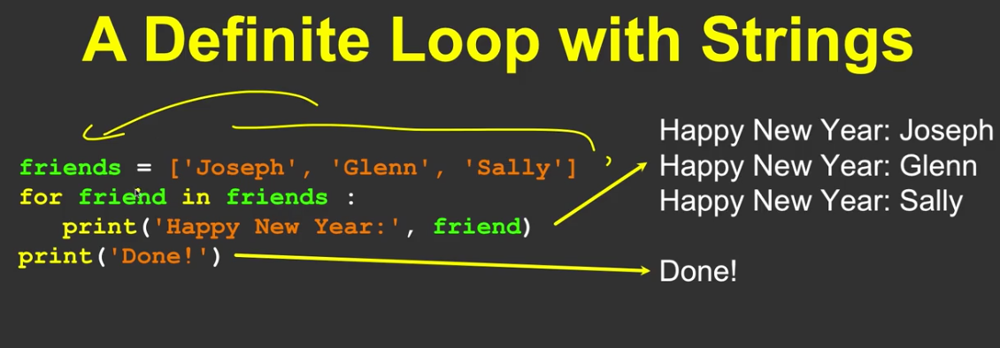

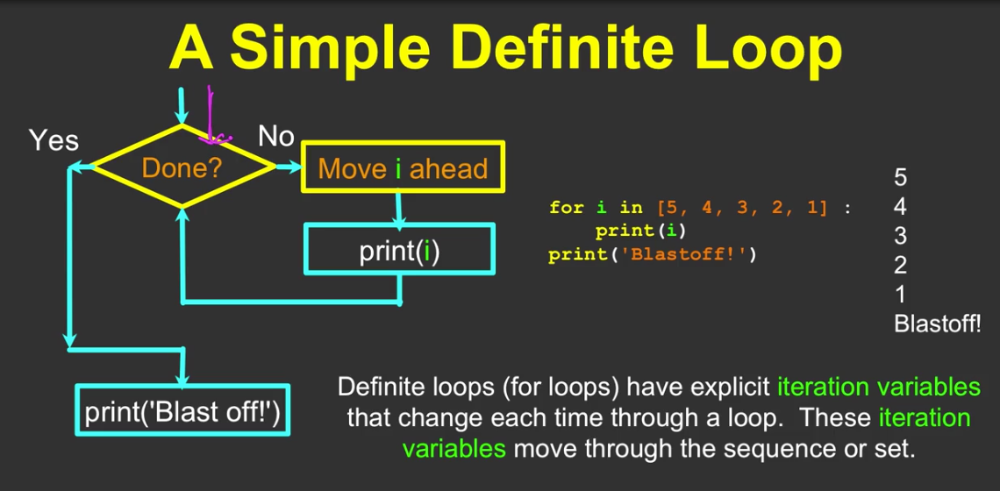

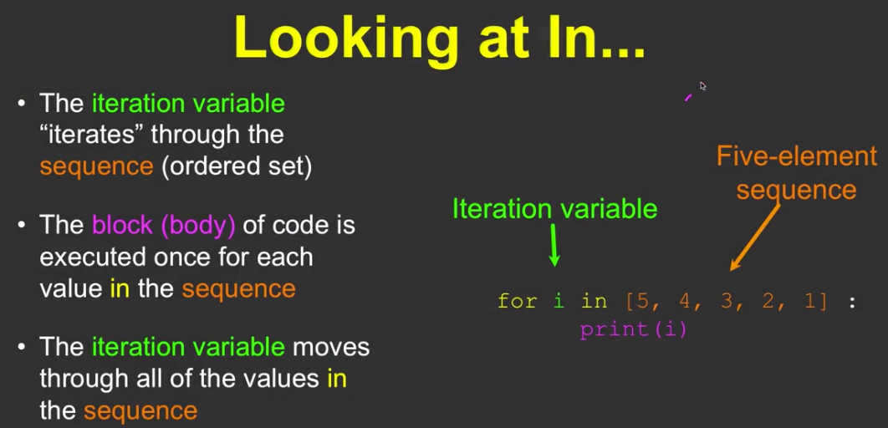

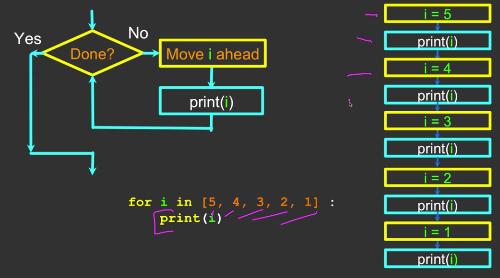

## 5.3 - Finding the Largest Value


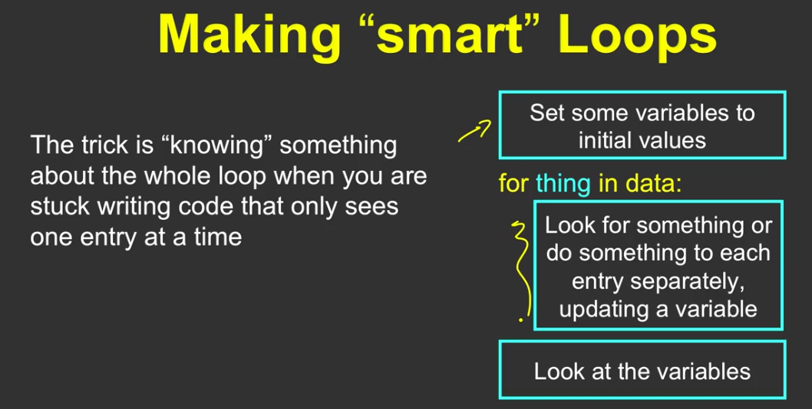

#### Largest so Far.....

```python
largest_so_far = -1
print('Before', larges)
```

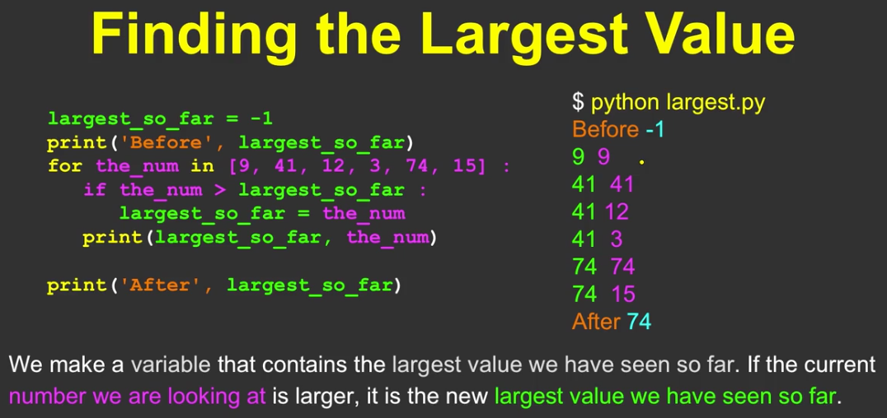

## 5.4 - Loop Idioms 


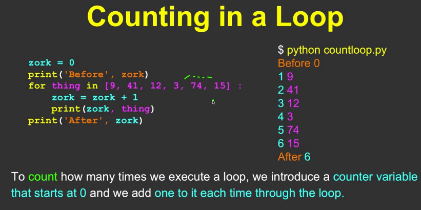


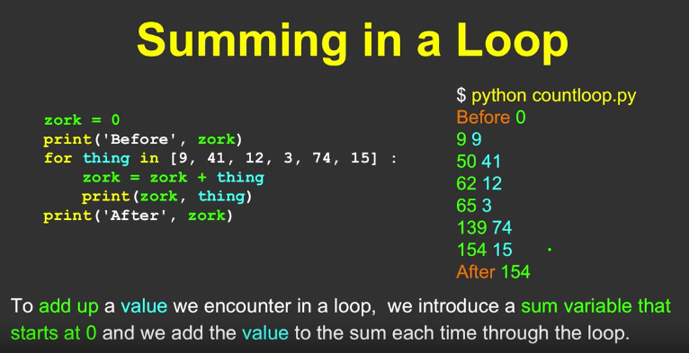

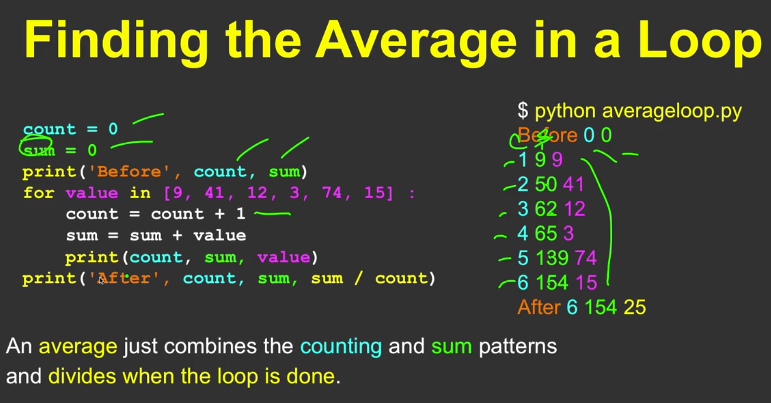

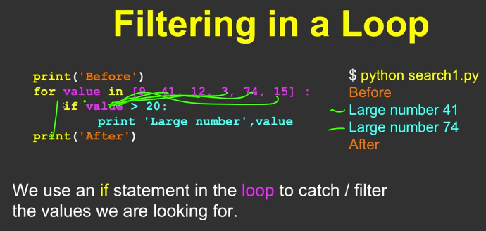

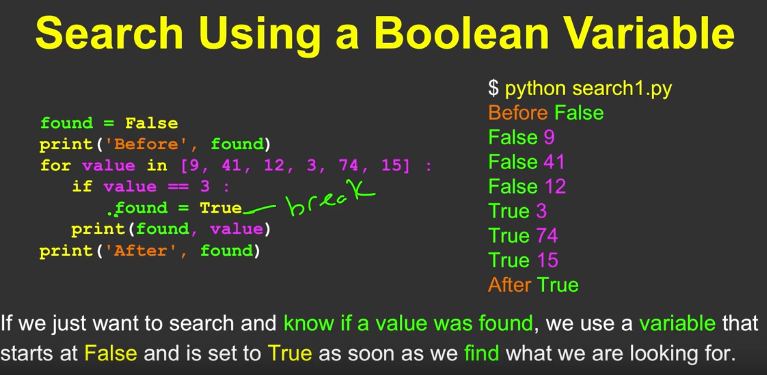

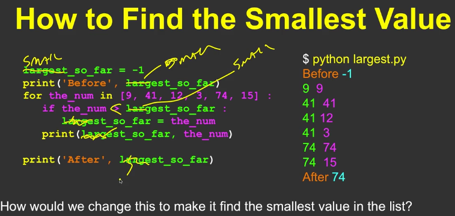

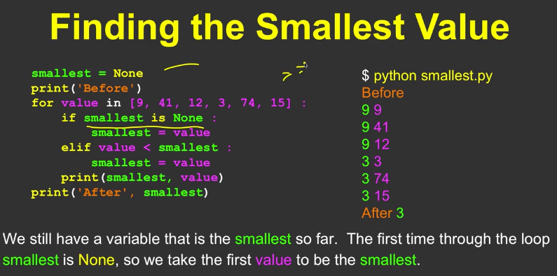

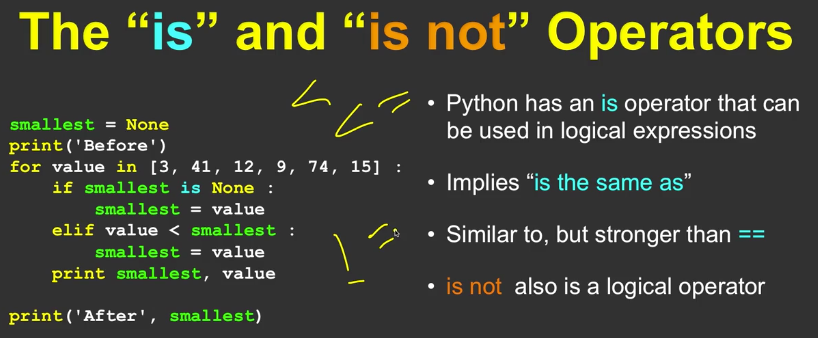